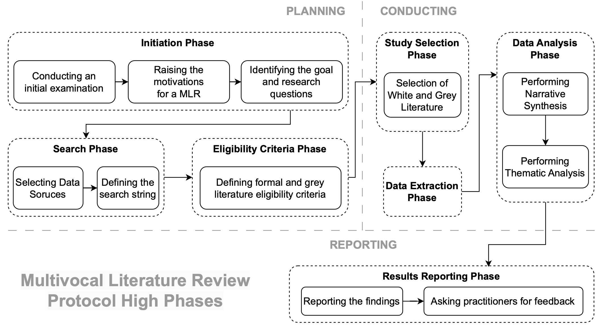

# Protocol and Execution

The goal of the study is to understand the current role and impact of bots and conversational agents in software
engineering, focusing on the:
1. motivations for their adoption,
2. challenges,
3. best practices, and
4. benefits provided to software engineers.

The purpose is to provide a comprehensive overview of the matter, which might be useful to learn about the current state of the art and of the practice. Moreover, we want to stimulate further research to be pursued. The perspective is of both researchers and practitioners: the former are interested in having a unique resource to use as a starting point to deepen their knowledge of the research field; the latter are interested in understanding best practices, challenges, and benefits of using bots in practice.

To achieve our goal, we performed a Multivocal Literature Review (MLR), namely, a research process where past published (formal) literature (e.g., journal and conference papers) and grey literature (e.g., blog posts, videos, and white papers) on the topic investigated are systematically identified, selected, and critically assessed (Garousi et al. (2019)). An MLR builds on top of the concept of Systematic Literature Review (SLR)—where only the formal literature is taken into account—to provide benefits not only to the research community but also to practitioners.

---
##  Initiation Phase

### Initial Examination of Previous Studies

To collect insights and basic knowledge about the adoption of bots and conversational agents in software engineering, we conducted a preliminary investigation in which we reviewed a few existing studies on the matter. In particular, we used the Repository for Bot-related Research—a publicly available repository of formal literature maintained by the software engineering research community. After reading the studies, we discarded them in a "throw-away prototyping" to start the main review process with basic knowledge about the topic, avoiding possible bias or influence from no systematic intervention.

### Motivation and Needs Identification

Before choosing to conduct an MLR, it was suggested to investigate the current state of the art on the topic of interest to identify limitations that grey literature could address. For this reason, a checklist was defined that consists of seven "Yes" / "No" questions related to the complexity and interest of the topic (Garousi et al. (2019)). A high number of "Yes" justifies the inclusion of grey literature in the systematic analysis. This step is crucial to prevent the inclusion of grey literature from being of no benefit to research and resulting in a futile effort. As for our study, a filled checklist reports six out of seven responses were "Yes," which allowed us to decide to proceed with including grey literature in our study.

- **Question Analysis:**
  - The first two questions were about the topic itself rather than the work. The use of bots in software engineering is considered complex from both a technical and social perspective. Furthermore, the broad adoption of bots, coupled with the recent advent of generative AI, leads to a wide range of issues to analyze.
  - The third question focuses on the subject under study in the work. Literature has shown that the study context is central to software engineering research. This becomes even more true when it comes to bots and their impact on practitioners. Hence, the contribution of grey literature to characterize this context is essential.
  - Questions four, five, and six are about the work objectives. The goal of the work is to provide knowledge suitable for opening new avenues of research and improving the use and adoption of technology by practitioners. Corroborating academic research with practitioners’ knowledge is essential.
  - Regarding question seven, significant evidence about the extensive adoption of bots by practitioners was found, increasing the importance of the context on the matter.

### Goals and Research Questions Definition

Our main objective was to provide an overview of the use of bots and conversational agents for software engineering purposes. We investigated four aspects that led to multiple research questions to reach our goal.

- RQ1—Which motivations and goals cause the use of bots and conversational agents in software engineering?
- RQ2—What are the challenges related to using bots and conversational agents in software engineering?
- RQ3—What are the best practices for using bots and conversational agents in software engineering?
- RQ4—What are the benefits of using bots and conversational agents for software engineering?

---
## Search Phase

### Data Sources Selection

This phase aims to identify the most reliable databases from which to extract the literature to start our process. This step is crucial for the success of the literature review and differs between formal and grey literature.

#### Formal Literature
To collect the formal literature, we selected **Scopus**, **IEEE Xplore**, and **ACM Digital Library** as data sources. These databases are considered the top three in computer science formal literature sources and have been used in various other literature reviews and recommended in guidelines as they provide a complete overview of the published research. As recommended, we took all results extracted from the first research and filtered them using eligibility criteria.

#### Grey Literature
To search the grey literature, we used the Google search engine because Google has been used by other MLRs on Software Engineering and is recommended in various MLR guidelines.

Deciding when to stop the search process is a complex problem—mainly caused by the high volume of available items. For this reason, we adopted two different choices as recommended:
- **Theoretical saturation:** We stop the research when no new concepts emerge from the search results anymore.
- **Effort Bounded:** This regards the inclusion of the top N search engine hits only. We analyzed the first ten pages produced by Google, observing that its algorithm retrieves and shows the most relevant results in the first few pages.

### Search String Design

In this phase, we defined different search strings to collect the formal and grey literature. We used the knowledge obtained during the initial examination to draft the search string. Its definition was based on:
1. Key terms on the topic of interest—gathered from relevant papers,
2. Synonyms and alternative terms, and
3. Logical connectors to combine different terms in different ways.

The initial version of the search string included basic terms such as "bots" and "software engineering." During the preliminary exploration phase, we began to use the string and improve it in accordance with the results obtained. We focused on the individuation of synonyms, which led first to the expansion of the search string for formal literature and then to the detailed definition of the different strings for grey literature.

    (“bot(s)” 𝑂𝑅 “chatbot(s)” 𝑂𝑅 “chat bot(s)” 𝑂𝑅 “conversational agent(s)”) 𝐴𝑁 𝐷 (“software engineering”)

---
### Eligibility Criteria Phase

In this phase, the aim is to define a series of criteria to apply after collecting the literature for filtering and identifying those that provide direct evidence based on our research questions. The phase consisted of two sub-phases:
1. **Defining the formal literature eligibility criteria**
2. **Defining the grey literature eligibility criteria**

#### Formal Literature Eligibility Criteria

The eligibility criteria for formal literature are divided into three sets that had to be evaluated for each paper extracted from the search phase:
1. **Exclusion Criteria** - Criteria that, if met for at least one of them, decree the elimination of the article from the analysis set.
2. **Inclusion Criteria** - Criteria that, if met for at least one of them, decree the inclusion of the article into the analysis set.
3. **Quality Criteria** - Criteria that are used to grade articles and may lead to their elimination if the grade is below a certain threshold.

We defined such criteria according to the guidelines and past literature in the Software Engineering field. Each criterion could be only True or False. Using these filters, we could exclude all preliminary research results, e.g., workshops or posters, and avoid considering duplicated papers derived from the combination of three data sources. However, we decided not to exclude workshop papers reported in the Repository for Bot-related Research since these could be highly related to this work’s main reference community. In addition, we included criteria to ensure that the collected papers were concerned with the topic of interest. Regarding our exclusion criteria, it is worthy of discussion the criterion "Articles written before 2014". We decided to apply such criteria based on the finding of previous literature reviews, which report that literature on software bots—particularly in their communication-oriented form—started growing after 2014.

Regarding the quality criteria, we defined them as follows:
- **Q1:** Is the valuable information for the review clearly reported and indicated in the paper?
- **Q2:** Are the findings clearly reported in the paper?
- **Q3:** Are the RQs or objectives clearly defined?
- **Q4:** How many pages does the paper consist of? (with respect to the top venue formats)

The first three questions could be answered as "Yes", "Partially", "No". Each answer corresponded to a numerical value, i.e., ‘1’, ‘0.5’, ‘0’, respectively. The sum of these values reflects the quality score of the article. If the score was lower than 2, we excluded it from the review. The last one could be answered as "1 to 2", "3 to 4", and "4 and up".

#### Grey Literature Eligibility Criteria

Concerning the grey literature eligibility criteria evaluation, we followed the guideline proposed—Garousi et al. (2019)—combining inclusion and exclusion criteria with quality assessment criteria.

---
## Studies Selection Phase

In the studies selection phase, the aim was to apply the planned strategy to collect the relevant literature.

- **Formal Literature Selection**: We started by running the search string on the three selected databases, e.g., Scopus, obtaining a set of 2108 studies. We imported the results into Excel, and the first two authors began the inclusion and exclusion process by:
  1. Deleting duplicates from the merged datasets.
  2. Dividing the remaining papers into two sets and applying the eligibility criteria, initially by reviewing the title, abstract, and if necessary, the entire body of the articles.
  3. After individually analyzing 20 papers, the two authors discussed their findings; no conflict arose, and they continued with the exclusion and inclusion criteria, resulting in 173 studies included and 1935 excluded.
  4. A further joint filtering session by all authors on the 173 remaining studies aimed at identifying potential errors, leading to the exclusion of an additional 64 studies, resulting in a final set of 109 studies.
  5. The first two authors then applied the quality criteria, narrowing it down to 79 studies from the formal literature.

- **Grey Literature Selection**: The first author used the search strings on the Google Search Engine, checking the first 10 pages for each string and importing items related to the work objectives into an Excel file until theoretical saturation was reached. This process resulted in a set of 52 items, with 28 meeting all eligibility criteria after review by the first two authors.

After completing the extraction and selection process for both the formal and grey literature, we combined the two sets, resulting in a comprehensive collection of 107 articles, which formed the basis for the subsequent data extraction phase. The distribution of literature included blogs, conference papers, workshop papers, and journal papers, with a significant number coming from conferences like the International Workshop on Bots in Software Engineering (BotSE).

## Data Extraction Phase

We defined a series of data extraction forms based on our objectives and research questions. These forms were used to identify relevant elements in the articles to answer our research questions. Data were extracted using predefined forms, and any new information led to the creation of new columns in an Excel file, whereas repeated information was marked accordingly. All extracted data are detailed in our online appendix.

## Data Synthesis and Analysis Phase

We synthesized the data collected to present it to the target audience in a readable and usable way. We employed narrative synthesis to describe and interpret the primary evidence and thematic analysis to summarize studies under a set of recurrent themes. Descriptions were annotated and categorized based on similarity, and each category was assigned to a new column in the Excel file. The process ensured that thematic similarities were grouped and traceability was maintained.

---
## Results Reporting Phase

Based on the target audience of practitioners and researchers, we enhanced readability by including a "benefits" section, soliciting practitioner feedback on our results, and using various tools to enhance result summaries. This approach aimed to ensure that the results were accessible and practical for both practitioners and researchers.
